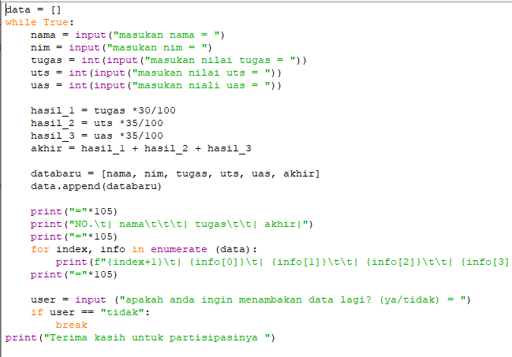
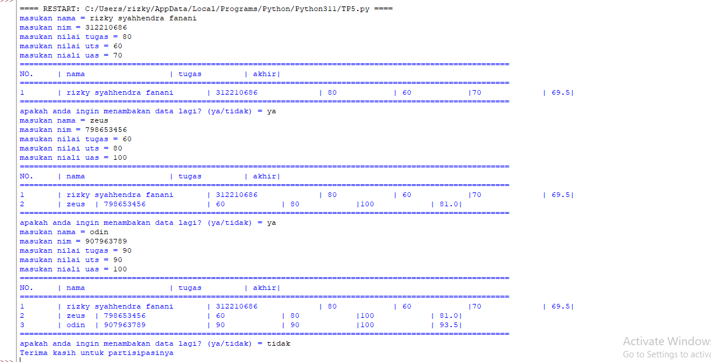

# latihan5

## 1. Buat sebuah list sebanyak 5 elemen dengan nilai bebas 

### output 

## Tampilkan elemen ke 3 
Untuk menampilkan elemment ke tiga menggunakan print(list[2]) dimana "[2]" adalah index dari element ketiga 

### output

## Ambil nilai elemen ke 2 sampai elemen ke 4 
Untuk menampilkan elemment kedua sampai ke empat menggunakan print(list[1:4]) dimana "[1:4]" adalah index dari element kedua sampai keempat

### output 

## Ambil elemen terakhir 
Untuk menampilkan elemment terakhir menggunakan print(list[4]) dimana "[4]" adalah index dari element terakhir  

### output

# 2. Ubah elemen list 
## Ubah elemen ke 4 dengan nilai lainnya 
Untuk mengubah element ke 4 didalam list, menggunakan namavariable [3]= "element baru" artinya kita ingin mengubah index 3 dengan nilai yang baru. 

### output 

## Ubah elemen ke 4 sampai dengan elemen terakhir 
Untuk mengubah element ke 4 sampai dengan terakhir, menggunakan namavariable [3:]= "element1, element2" artinya kita ingin mengubah index 3 sampai terakhir dengan nilai yang baru.  

### output 

# 3. Tambah elemen list 
## Ambil 2 bagian dari list pertama (A) dan jadikan list ke 2 (B) 
Untuk mengambil 2 bagian element dari list A ke list B menggunakan syntax berikut: 

### output  

## Tambah list B dengan nilai string 
Untuk menambahkan list B dengan nilai string dapat menggunakan method append. 

### output 

## Tambah list B dengan 3 nilai 
Untuk menambahkan list B dengan 3 nilai dapat menggunakan method extend.  

### output 

## Gabungkan list B dengan list A 
Untuk menggabungkan list A dan B dapat menggunakan operator +.  

### output

# Tugas Praktikum 
Buat program sederhana untuk menambahkan data kedalam sebuah list dengan rincian sebagai berikut: 
- Progam meminta memasukkan data sebanyak-banyaknya (gunakan perulangan) 
- Tampilkan pertanyaan untuk menambah data (y/t?), apabila jawaban t (Tidak), maka program akan menampilkan daftar datanya. 
- Nilai Akhir diambil dari perhitungan 3 komponen nilai (tugas: 30%, uts: 35%, uas: 35%) 
- Buat flowchart dan penjelasan programnya pada README.md. 
- Commit dan push repository ke github 
## Program

## output

Flowchart 

